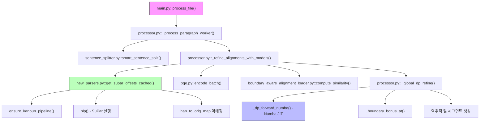
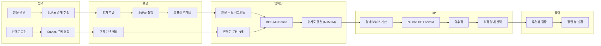

# PA (Paragraph Aligner) 코드 해부

**버전**: 2026-01-15  
**목적**: PA 파이프라인의 함수 로직과 알고리즘을 낱낱이 분석

---

## 0. 함수 호출 계층도 (Call Hierarchy)



---

## 0.1 알고리즘 흐름도 (Algorithm Flow)



---

## 1. 하이브리드 토크나이저 (Hybrid Tokenizer)

**파일**: `p2s/sentence_splitter.py`, `p2s/processor.py`

PA는 고전 한문의 특수성과 한국어 정밀 분석을 위해 **Hybrid** 접근법을 사용합니다.

### 1.1 원문(Source): SikuBERT + Kiwipiepy
- **SikuBERT**: 사고전서(四庫全書)로 학습된 모델을 통해 한자 한 글자 단위의 의미를 이해합니다.
- **Kiwipiepy**: 형태소 분석을 통해 한글 현토(하사대, 호되 등)를 인식합니다.
- **결합**: 한자는 SikuBERT 토큰으로, 현토는 Kiwipiepy 형태소로 처리하여 "의미"와 "문법"을 동시에 포착합니다.

### 1.2 번역문(Target): RoBERTa-Hanja + Kiwipiepy
- **RoBERTa-Hanja**: 한자 혼용 현대 한국어에 특화된 인코더입니다.
- **작동**: 먼저 Kiwipiepy로 형태소를 분리한 뒤, 이를 RoBERTa의 서브워드(Subword) 토큰으로 재분할하여 고차원 벡터로 변환합니다.

---

## 2. 파서 및 문장 분할 (Parser & Splitting)

**파일**: `common/new_parsers.py`

### 2.1 SuPar-Kanbun (Dependency Parser)
SuPar는 단순히 마침표를 찾는 것이 아니라, **의존 구문 분석(Dependency Parsing)**을 통해 문장의 주술 관계를 파악합니다.
- **Danku(斷句) 모드**: 구두점이 없는 텍스트에서 문법적 완결성을 기준으로 경계를 예측합니다.
- **Han-Extraction 전략**: 한글 현토가 섞인 경우 `\p{Han}`만 추출하여 SuPar에 전달하고, 반환된 오프셋을 원본 텍스트로 역매핑(Inverse Mapping)합니다.

### 2.2 Stanza (Target Parser)
번역문(한국어)은 Stanza를 통해 문장 경계를 확정합니다. 
- **Rule-based 후처리**: Stanza가 분리한 문장 중 "말씀하셨다."와 같이 앞 문장에 붙어야 하는 경우를 정규식으로 감지하여 강제 병합합니다.

---

## 3. BGE-M3 임베더 (Multi-Vector Architecture)

**파일**: `common/embedders/bge.py`

BGE-M3는 세 가지 벡터를 결합하여 **1636차원** 이상의 정보를 활용합니다.

### 3.1 벡터 구성 및 합산 로직
1.  **Dense Score (1024차원)**: 전체 문맥 유사도 (Cosine Similarity)
2.  **Sparse Score (Lexical)**: 키워드 일치 여부 (BM25와 유사한 가중치 합)
3.  **Multi-Vector Score (ColBERT)**: 각 토큰별 최대 유사도의 합 (MaxSim)

### 3.2 유사도 가중치 (Similarity Weights)
실제 코드에서는 다음과 같은 비율(표준값)로 합산됩니다:
```python
final_score = (dense_weight * dense_sim) + 
              (sparse_weight * sparse_sim) + 
              (colbert_weight * colbert_sim)
```
*현재 그리드 서치를 통해 이 가중치들의 최적 조합을 찾고 있습니다.*

---
 
 ## 4. 경계 모델 및 보너스 (Boundary Model & Bonus)
 
 **파일**: `p2s/processor.py` (내부 함수 `_boundary_bonus_at`), `common/boundary_model_loader.py`
 
-### 4.1 Boundary Model (Logit)
+### 4.1 경계 모델 코드 해부 (Model Anatomy)
+
+PA는 `MultiHeadBoundary` 클래스를 통해 문맥 정보를 처리합니다.
+
+#### 4.1.1 신경망 내부 (The Neural Engine)
+1.  **CharEncoderForBoundary**:
+    - `nn.Embedding(vocab_size, 64, padding_idx=0)`
+    - `nn.LSTM(64, 128, num_layers=2, bidirectional=True)`
+    - 각 글자는 좌측/우측의 128글자 맥락을 흡수하여 **256차원**의 은닉 상태(Hidden State)를 갖게 됩니다.
+2.  **Task-specific Projection**:
+    - `nn.Linear(256, 1)`: 256차원 문맥 벡터를 단일 스칼라(Logit)로 압축합니다.
+
+#### 4.1.2 로짓 가공 (Logit Engineering)
 신경망이 각 글자 위치 `i`에 대해 경계일 확률을 `logit[i]`로 내뱉습니다.
 - **가공**: `0.020 * max(0.0, tanh(logit/3.0))`
 - **의미**: 강한 긍정 로짓에 대해서만 지수적으로 보너스를 부여하며, 음수 로짓(경계 아님)은 패널티로 쓰지 않아 모델 오판에 의한 DP 왜곡을 방지합니다.
 
+#### 4.1.3 훈련 전략 (Training Strategy)
+- **BCEWithLogitsLoss**: 각 위치 별 이진 분류 수행
+- **Class Weighting**: 경계(Positive)가 매우 희소(Sparse)하므로, 경계에 약 **10~20배의 가중치**를 부여하여 학습 시 경계를 놓치지 않도록 강제합니다.
+
 ### 4.2 SuPar Bonus Injection
- **SuPar 오프셋**: `supar_offsets_norm` (공백 제거 후 좌표계)
- **적용**: `pos`가 SuPar의 예측점과 일치하면 `supar_bonus` (0.20)를 즉시 합산합니다.
- **전략**: SuPar의 고전 문법 지식을 DP의 비용 함수에 강력한 **가이드라인**으로 주입합니다.

---

## 5. DP 정렬 알고리즘 (Numba Dynamic Programming)

**파일**: `p2s/processor.py` (함수 `_global_dp_refine`)

### 5.1 점수 행렬 (Score Matrix) 계산
번역문 문장 `j`와 모든 가능한 원문 세그먼트 `(i_start, i_end)` 조합에 대해 유사도를 계산합니다.
- **배치 처리**: GPU 효율을 위해 모든 가능한 원문 조각을 하나의 배치로 묶어 임베딩을 계산합니다.

### 5.2 점화식 및 역추적 (Backtracking)
Numba JIT로 가속된 루프에서 원문의 최적 분할 지점을 결정합니다.
- **Cost Function**: `Similarity + Boundary_Bonus + Style_Bonus`
- **역추적**: `dp_table`을 채운 뒤 마지막 문장부터 거꾸로 올라오며 최적의 경계 인덱스를 확정합니다.

---

## 6. 무결성 검증 (Integrity Validation)

**파일**: `p2s/processor.py` (리파인 종료 시점)

정렬이 완료된 후, 시스템은 다음과 같은 엄격한 검증을 수행합니다.

### 6.1 텍스트 보존 검증 (Text Invariance)
- **로직**: `original_src == "".join(predicted_src_segments)`
- **검사**: 단 한 글자라도 누락되거나 중복되었는지 체크합니다. 공백을 제외한 모든 유니코드 문자가 일치해야 합니다.

### 6.2 정렬 개수 검증 (Count Match)
- **로직**: `len(src_segments) == len(tgt_sentences)`
- **검사**: 번역문 문장 수와 강제로 맞춘 원문 세그먼트 수가 일치하는지 확인합니다.

### 6.3 Do-No-Harm 게이트
- **로직**: `DP_Score > Greedy_Score + Gain_Threshold`
- **검사**: DP가 제안한 새로운 분할이 기존(Greedy) 방식보다 임상적으로 유의미한 점수 향상이 있을 때만 최종 결과로 채택합니다.

---

## 7. 캐시 레이어 해부 (Cache Anatomy)

성능의 핵심은 **5중 캐시**에 있습니다.

1.  **Parser Cache**: SuPar/Stanza 결과를 담은 JSON (텍스트 변경 전까지 불변)
2.  **BGE Cache**: 텍스트 조각별 1024차원+α 벡터 저장 (`.npy`, `.pkl`)
3.  **Sim Cache**: (원문, 번역문) 쌍의 최종 유사도 점수 저장
4.  **Boundary Cache**: 특정 오프셋의 보너스 점수 계산 결과
5.  **Memory Store**: 현재 프로세스 내에서의 반복 접근 방지

---

## 8. 전체 워크플로우 요약 (Flowchart)

1.  **Load**: 데이터 및 모델 로드 (SikuBERT, BGE, SuPar 등)
2.  **Split**: Stanza로 번역문 확정 + SuPar로 원문 가이드 생성
3.  **Candidate**: 원문에서 가능한 모든 경계 후보 추출 (Boundary Model + Punctuation)
4.  **Matrix**: 각 번역문 문장 vs 모든 원문 후보 조각 간 유사도 행렬 생성 (BGE-M3 1636차원)
5.  **DP**: Numba JIT 컴파일된 루프로 전역 최적화 경로 탐색
6.  **Verify**: 텍스트 무결성 및 개수 일치 확인
7.  **Output**: XLSX 저장 및 성능(F1) 평가
