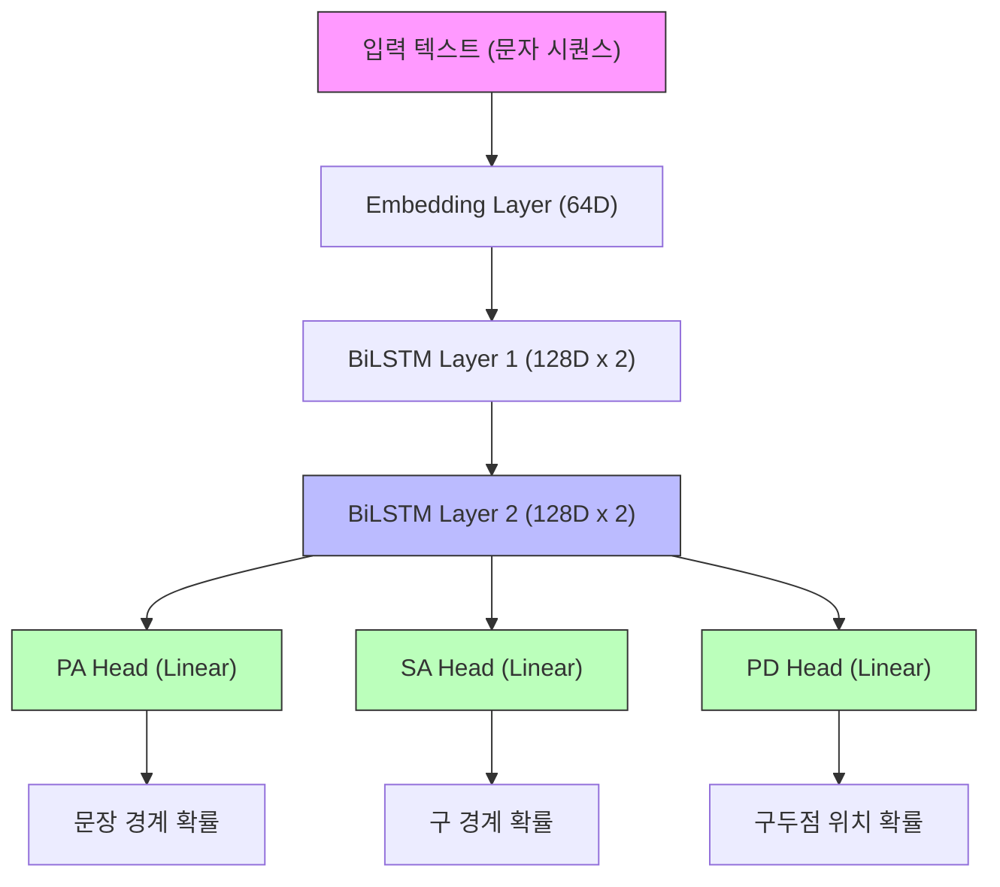

# P2S (Paragraph-to-Sentence Aligner) 메커니즘 상세 설명

**버전**: 2026-01-15  
**목적**: 고전 한문(원문)과 현대 한국어(번역문) 간의 문장 단위 정렬  
**약칭**: P2S (구: PA)

---

## 1. 개요

PA(Paragraph Aligner)는 **문단 단위**로 입력된 원문-번역문 쌍을 **문장 단위**로 분할하고 정렬하는 시스템입니다.

### 1.1 입력과 출력

| 구분 | 형식 | 예시 |
|------|------|------|
| **입력** | 문단 단위 (원문, 번역문) | ("子曰學而時習之不亦說乎", "선생님께서 말씀하셨다. 배우고 때때로 익히면 기쁘지 아니한가.") |
| **출력** | 문장 단위 정렬 쌍 | [("子曰", "선생님께서 말씀하셨다."), ("學而時習之不亦說乎", "배우고 때때로 익히면 기쁘지 아니한가.")] |

### 1.2 핵심 과제

고전 한문과 현대 한국어는 언어 구조가 완전히 다릅니다:
- **한문**: 공백/구두점 없이 연속된 한자
- **한국어**: 어절 단위로 공백 구분, 구두점으로 문장 경계 명확

따라서 단순 규칙 기반 분할이 불가능하며, **의미적 유사도**를 기반으로 정렬해야 합니다.

### 1.3 핵심 전략: 번역문 기준 정렬

**P2S의 핵심 전략**은 번역문(한국어)의 **의미적 문장 단위** 경계를 먼저 확정하고, 원문(한문)의 경계를 그에 맞춰 **조정**하는 것입니다.

```
번역문: [의미단위1] [의미단위2] [의미단위3]  ← 확정 (규칙 기반 분할)
             ↓          ↓          ↓
원문:      [???]  +   [???]  +   [???]     ← 조정 (유사도 최대화)
```

#### 번역문의 "의미적 문장 단위" 결정

번역문(한국어) 분할은 단순 구두점이 아닌 **의미 기반 규칙**을 적용합니다:

| 규칙 | 예시 | 설명 |
|------|------|------|
| **발화자-발화내용 통합** | "공자께서 말씀하셨다. 배우고..." → [**통합**] | `"공자께서 말씀하셨다."`를 분리하지 않고 뒤따르는 발화 내용(`"배우고..."`)과 하나로 묶습니다. |
| **인용 종결부 통합** | "...라고 하였다." → [**통합**] | 인용부호 뒤의 종결부(`"~라고 하였다"`)를 앞의 인용 내용과 분리하지 않고 하나의 세그먼트로 보존합니다. |
| **종결어미 인식** | "-다", "-까", "-라" | 문장 종결 패턴 인식 |
| **복합문 처리** | "...하니, ...하도다." | 의미적으로 연결된 절은 통합 |

**이유**:
1. **번역문은 경계가 상대적으로 명확**: 종결어미, 구두점, 인용부호 활용
2. **원문은 경계가 모호**: 한자가 연속되어 규칙 기반 분할 불가
3. **번역문 문장 수 = 원문 문장 수**: 1:1 매칭 가정

**따라서**: 번역문의 M개 의미 단위에 맞춰 원문을 M개 세그먼트로 분할하는 **최적 경계 위치**를 찾는 문제로 정의됩니다.

---

## 2. 파이프라인 구조

PA는 크게 5단계로 구성됩니다:

```
[입력 문단] 
    ↓
[1단계] 문장 분할 (각 언어별)
    ↓
[2단계] 경계 후보 생성
    ↓
[3단계] 유사도 기반 매칭
    ↓
[4단계] DP 리파인 (선택적)
    ↓
[출력 정렬 쌍]
```

---

## 3. 1단계: 문장 분할

### 3.1 원문(한문) 분할: SuPar-Kanbun

**SuPar-Kanbun**은 고전 한문 전용 의존 구문 분석기(Dependency Parser)입니다.

**작동 원리**:
1. 연속된 한자 문자열을 입력받음
2. 각 문자 간의 문법적 관계(주어-동사, 동사-목적어 등)를 분석
3. 문장 종결 위치를 추론하여 분할

**예시**:
```
입력: "子曰學而時習之不亦說乎有朋自遠方來不亦樂乎"
출력: ["子曰學而時習之不亦說乎", "有朋自遠方來不亦樂乎"]
```

### 3.2 번역문(한국어) 분할: Stanza

**Stanza**는 Stanford NLP Group의 다국어 NLP 도구입니다.

**작동 원리**:
1. 한국어 문장을 토큰화
2. 구두점(., !, ?)과 문법 구조를 분석
3. 문장 경계를 결정

**예시**:
```
입력: "선생님께서 말씀하셨다. 배우고 때때로 익히면 기쁘지 아니한가."
출력: ["선생님께서 말씀하셨다.", "배우고 때때로 익히면 기쁘지 아니한가."]
```

---

## 4. 2단계: 경계 후보 생성

문장 분할기 외에도 다양한 소스에서 경계 후보를 수집합니다.

### 4.1 경계 후보 소스

| 소스 | 설명 | 신뢰도 |
|------|------|--------|
| **SuPar** | 구문 분석 기반 분할점 | 높음 |
| **Stanza** | 문법 구조 기반 분할점 | 높음 |
| **어절 경계** | 공백 위치 (한국어) | 중간 |
| **구두점** | 마침표, 물음표 등 | 높음 |
| **Boundary Model** | 신경망 예측 경계 | 가변 |

### 4.2 Boundary Model

별도 학습된 신경망 모델이 각 문자 위치가 "문장 경계일 확률"을 예측합니다.

**구조**:
- 입력: 원문 + 번역문 문자 시퀀스
- 출력: 각 위치의 경계 확률 (0~1)

**적용**:
- `boundary_threshold` (예: 0.72) 이상인 위치만 경계 후보로 채택

---

## 5. 3단계: 유사도 기반 매칭

### 5.1 임베딩 (Embedding)

텍스트를 고차원 벡터로 변환합니다.

**사용 모델**: BGE-M3 (Multilingual, Multi-Functionality, Multi-Granularity)

#### 5.1.1 Multi-Vector 임베딩

BGE-M3는 **Multi-Vector** 방식을 사용하여 텍스트의 다양한 측면을 포착합니다:

| 벡터 유형 | 차원 | 설명 |
|----------|------|------|
| **Dense Vector** | 1024 | 전체 의미를 압축한 단일 벡터 |
| **Sparse Vector** | 가변 | 중요 토큰의 가중치 (BM25 유사) |
| **ColBERT Vector** | 1024 × N | 각 토큰별 벡터 (Late Interaction) |

#### 5.1.2 유사도 계산 (총 1636차원 활용)

실제 유사도 점수는 여러 벡터의 조합으로 계산됩니다:

```
최종_유사도 = α × dense_sim + β × sparse_sim + γ × colbert_sim
```

| 구성 요소 | 계산 방법 | 역할 |
|----------|----------|------|
| Dense Similarity | 코사인 유사도 (1024차원) | 전체 의미 비교 |
| Sparse Similarity | 토큰 가중치 내적 | 키워드 매칭 |
| ColBERT Similarity | MaxSim (토큰별 최대 유사도 합) | 부분 매칭 |

**각 차원의 역할**:
- **Dense (1024)**: "이 문장이 전체적으로 무슨 뜻인가?"
- **Sparse (~100)**: "핵심 단어가 일치하는가?"
- **ColBERT (1024×N)**: "세부 표현이 얼마나 대응하는가?"

#### 5.1.3 코사인 유사도

```
similarity = (벡터A · 벡터B) / (||벡터A|| × ||벡터B||)
```
- 1에 가까울수록 의미가 유사
- 0에 가까울수록 관련 없음
- -1에 가까울수록 반대 의미

### 5.2 후보 매칭

모든 가능한 (원문 세그먼트, 번역문 세그먼트) 조합에 대해 유사도를 계산하고, 가장 높은 점수의 매칭을 선택합니다.

**점수 구성**:
```
총점 = 유사도_점수 + 경계_보너스 + 스타일_보너스 - 패널티
```

| 요소 | 설명 |
|------|------|
| 유사도_점수 | BGE 임베딩 코사인 유사도 |
| 경계_보너스 | Boundary Model이 예측한 경계일 때 추가 점수 |
| 스타일_보너스 | 문장 종결형 어미("-다", "-까")로 끝날 때 가산 |
| 패널티 | 너무 짧은 세그먼트, 불균형 길이 등에 감점 |

---

## 6. 4단계: DP 리파인 (Dynamic Programming Refinement)

### 6.1 목적

3단계의 탐욕적(Greedy) 매칭은 지역 최적(Local Optimum)에 빠질 수 있습니다. DP 리파인은 **전역 최적(Global Optimum)**을 찾습니다.

### 6.2 문제 정의

- **원문**: 총 N개의 경계 후보 위치
- **번역문**: M개의 문장으로 분할됨
- **목표**: N개 후보 중 M-1개를 선택하여 원문을 M등분

### 6.3 DP 알고리즘

**상태 정의**:
```
dp[i][j] = i번째 번역문 문장까지 매칭할 때, 
           j번째 경계 후보를 선택했을 때의 최대 총점
```

**전이 (Transition)**:
```
dp[i][j] = max(dp[i-1][k] + score(k→j, target[i])) for all valid k < j
```

여기서 `score(k→j, target[i])`는:
- 원문의 k~j 구간과 번역문 i번째 문장 간의 유사도

**시간 복잡도**: O(M × N²)

### 6.4 Do-No-Harm 게이트

DP 리파인 결과가 원래 결과보다 **명확히 좋을 때만** 적용합니다.

```
적용 조건: DP_총점 > 원래_총점 + min_gain
```

이는 미세한 차이로 경계가 크게 변하는 것을 방지합니다.

---

## 7. 성능 최적화

### 7.1 캐싱 전략

| 캐시 종류 | 대상 | 효과 |
|-----------|------|------|
| **BGE 캐시** | 텍스트 → 임베딩 벡터 | GPU 재계산 방지 |
| **Parser 캐시** | 텍스트 → 분할 결과 | 파싱 재실행 방지 |
| **Sim 캐시** | (원문, 번역문) → 유사도 | 반복 계산 방지 |

### 7.2 Numba JIT 컴파일

DP 알고리즘의 핵심 루프를 **Numba**로 컴파일하여 C 수준의 속도를 달성합니다.

**적용 전**: Python 루프 → 느림  
**적용 후**: 기계어 컴파일 → 10~50배 빠름

### 7.3 GPU 배치 처리

유사도 계산을 개별 호출 대신 **배치(Batch)**로 묶어 GPU에 전송합니다.

```
개별 처리: GPU 호출 1000회 → 오버헤드 큼
배치 처리: GPU 호출 10회 (100개씩) → 오버헤드 작음
```

---

## 8. 파라미터 설명

### 8.1 주요 파라미터

| 파라미터 | 기본값 | 설명 |
|----------|--------|------|
| `boundary_aware_weight` | 0.30 | 경계 모델 점수 가중치 |
| `supar_bonus` | 0.20 | SuPar 경계에 주는 보너스 |
| `boundary_threshold` | 0.72 | 경계로 인정할 최소 확률 |
| `weight_terminal` | 0.018 | 종결 어미 보너스 |
| `weight_continuation` | -0.030 | 연결 어미 페널티 |

### 8.2 파라미터 튜닝

**Grid Search**를 통해 F1 점수를 최대화하는 파라미터 조합을 탐색합니다.

```
for bw in [0.25, 0.30, 0.35]:
    for sb in [0.15, 0.20, 0.25]:
        F1 = run_and_evaluate(bw, sb)
        if F1 > best_F1:
            best_params = (bw, sb)
```

---

## 9. 평가 지표

### 9.1 Micro F1 Score

**정밀도 (Precision)**:
```
Precision = 올바르게 예측한 경계 수 / 전체 예측 경계 수
```

**재현율 (Recall)**:
```
Recall = 올바르게 예측한 경계 수 / 전체 정답 경계 수
```

**F1 Score**:
```
F1 = 2 × (Precision × Recall) / (Precision + Recall)
```

### 9.2 Target-Exact 매칭

번역문 문장이 **정확히 일치**하는지 확인합니다.
- 예측: "선생님께서 말씀하셨다."
- 정답: "선생님께서 말씀하셨다."
- 결과: ✅ 일치 (TP)

---

## 10. 제한 사항 및 향후 과제

### 10.1 현재 제한

1. **1:1 매칭 가정**: 원문 1문장 = 번역문 1문장
   - 실제로는 1:2, 2:1 매칭도 존재
   
2. **문맥 무시**: 각 문단을 독립적으로 처리
   - 앞뒤 문단의 맥락 미반영

3. **도메인 특화**: 한문-한국어에 최적화
   - 다른 언어쌍 적용 시 재학습 필요

### 10.2 향후 개선 방향

1. **N:M 정렬 지원**: 유연한 매칭 구조
2. **Transformer 기반 Aligner**: End-to-end 학습
3. **문맥 인식**: 문단 간 정보 활용

---

## 부록 A: 용어 사전

| 용어 | 정의 |
|------|------|
| **토큰** | 텍스트의 최소 처리 단위 (문자, 어절, 단어) |
| **임베딩** | 텍스트를 수치 벡터로 변환한 것 |
| **코사인 유사도** | 두 벡터 간 각도의 코사인 값 |
| **DP** | Dynamic Programming, 동적 프로그래밍 |
| **JIT** | Just-In-Time, 실행 시점 컴파일 |
| **F1 Score** | 정밀도와 재현율의 조화 평균 |

---

## 부록 C: 경계 모델 해부 (Boundary Model Anatomy)

PA에서 사용하는 경계 모델(`boundary_multitask.pt`)은 텍스트의 형태적/구조적 특징을 학습하여 전역적인 문장 경계를 예측합니다.

### C.1 아키텍처 (Multi-task Architecture)

이 모델은 하나의 **공통 인코더**와 여러 개의 **태스크별 헤드**로 구성된 멀티태스크 구조입니다.



1.  **Char-level Encoder**:
    - **Embedding (64D)**: 개별 유니코드 문자를 수치화. (모든 문자를 학습 대상으로 함)
    - **BiLSTM (128D x 2 layers)**: 문자의 앞뒤 맥락을 256차원 벡터로 요약.
    - **효과**: "다." 뒤에 구두점이 올 때와 조사 뒤에 구두점이 올 때의 차이를 인지.
2.  **Multi-task Heads**:
    - **PA Head**: 문장 경계 예측 (Paragraph to Sentence)
    - **PD Head**: 마침표 위치 예측 (Punctuation Detection) - 문법적 종결 위치 학습 보조
    - **SA Head**: 구 경계 예측 (Sentence to Phrase) - 보조 태스크

### C.2 디코딩 로직 (Peak Detection & Constraints)

단순한 확률 임계값 적용뿐만 아니라, 다음과 같은 **해부학적 후처리**가 수행됩니다.

1.  **Logit-to-Post-Processing**:
    - 활성화 함수(tanh)를 통한 비선형 스코어 변환
    - 특정 위치에 점수가 집중되도록 유도
2.  **Local Peak Detection (그룹화)**:
    - 임계값을 넘는 연속된 위치가 발견되면, 그중 **가장 확률이 높은 지점(Peak)** 하나만 경계로 확정합니다. (중복 분할 방지)
3.  **Min-length Constraint**:
    - **PA 기본값**: 20자
    - **SA 기본값**: 6자
    - 너무 짧은 세그먼트가 생성되어 정렬 무결성을 해치는 것을 방지합니다.

### C.3 모델의 강점: 구조적 통찰

이 모델은 단순히 구두점을 찾는 것이 아니라, **"종결 어미 + 특수 기호 + 공백"**이라는 복합적인 패턴을 인지합니다. SuPar와 같은 구문 분석기가 놓칠 수 있는 번역문 특유의 종결 패턴을 보완하는 역할을 합니다.

