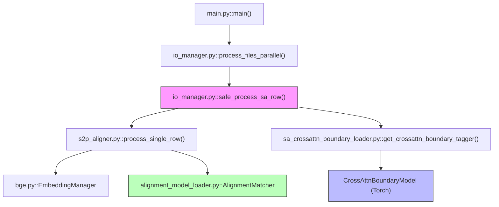

# SA (Sentence Aligner) 코드 해부

**버전**: 2026-01-19
**목적**: SA 파이프라인의 실질적 구현 로직과 모델 내부 구조 분석

---

## 0. 함수 호출 계층도 (Call Hierarchy)



---

## 1. 경계 모델 상세 해부 (Boundary Model Anatomy)

**파일**: `common/sa_crossattn_boundary_loader.py`, `scripts/train_sa_boundary_v3_char_hardneg.py`

SA의 핵심인 **Cross-Attention Boundary Model**의 내부 구조입니다.

### 1.1 하이 레벨 클래스 구조
- **CrossAttnBoundaryModel**: `nn.Module`을 상속받은 실제 신경망 구현체입니다.
- **CharBoundaryLoader**: 모델 가중치와 어휘집(Vocab)을 로드하고, 실제 텍스트 분할(`segment_text`)을 수행하는 인터페이스 클래스입니다.

### 1.2 레이어별 해부 (The Tissues)
1.  **Embedding Layer**:
    - `src_char_emb`: `nn.Embedding(src_vocab_size + 1, 128, padding_idx=0)`
    - `tgt_char_emb`: `nn.Embedding(tgt_vocab_size + 1, 128, padding_idx=0)`
    - **해부**: 0번 인덱스는 Padding(채움)으로 고정하여 가변 길이 문장을 처리합니다.
2.  **Encoder Layer (BiLSTM)**:
    - 2층의 Bidirectional LSTM. `hidden_dim=256`일 때 각 방향으로 128차원씩 할당됩니다.
    - `dropout=0.2`를 통해 학습 시 과적합을 방지합니다.
3.  **Cross-Attention Layer**:
    - **동작**: 번역문 벡터를 Query로, 원문 벡터를 Key/Value로 사용합니다.
    - `attn_output, attn_weights = self.cross_attn(query, key, value, key_padding_mask)`
    - **해부**: `key_padding_mask`를 통해 원문의 Padding 부분(0)은 어텐션을 주지 않도록 철저히 차단합니다.
4.  **Final Head (Decision Layer)**:
    - `torch.cat([tgt_hidden, cross_out], dim=-1)`: 자신의 문맥(번역문)과 참조된 문맥(원문)을 결합합니다.
    - `Linear(512, 256) -> ReLU -> Dropout -> Linear(256, 1)`: 단계적으로 정보를 요약하여 최종 로짓을 출력합니다.

---

## 2. 훈련 및 가중치 해부 (Training & Weighting Anatomy)

**파일**: `scripts/train_sa_boundary_v3_char_hardneg.py`

### 2.1 Boundary-aware Weights 생성 로직
이 로직은 경계 모델 성능을 F1 0.80에서 0.83으로 올린 핵심 장치입니다.

```python
# 훈련 샘플별 가중치 맵 생성
weights = torch.ones(tgt_max_len)
for i, label in enumerate(labels):
    if label == 'B': # 진짜 경계
        weights[i] = 3.0
        # Hard Negative: 경계 앞뒤 k글자는 틀리기 쉬우므로 학습 강도 높임
        for j in range(i-k, i+k+1):
            if j != i: weights[j] = 2.0
```

### 2.2 손실 함수 계산 (Weighted BCE)
```python
# 마스킹 처리된 가중 BCE 손실
mask = (tgt_char_ids != 0).float()
bce = nn.BCEWithLogitsLoss(reduction='none')(logits, labels)
weighted_bce = bce * weights * mask
loss = weighted_bce.sum() / mask.sum().clamp(min=1)
```
- **해부**: 패딩(`mask`)은 무시하고, 실제 문법적 의미가 있는 부분만 가중치를 곱해 손실을 계산합니다. 이를 통해 모델은 경계 지점과 그 주변의 미세한 차이를 더 집중적으로 학습하게 됩니다.

---

## 3. 정렬 로직 (Alignment Logic)

**파일**: `s2p/s2p_aligner.py`

경계 모델이 예측한 확률을 바탕으로 실제 구(Phrase)를 확정하는 과정입니다.

### 3.1 Thresholding & Segmentation
1.  `boundary_threshold` (0.55) 이상의 확률을 가진 인덱스를 수집합니다.
2.  수집된 인덱스를 경계점으로 삼아 번역문 텍스트를 분할합니다.
3.  **Preservation**: 분할 시 원본 텍스트의 유실이 전혀 없도록 인덱스 슬라이싱을 철저히 관리합니다.

### 2.2 구별 유사도 매칭
분할된 번역문 조각들을 원문의 대응 구와 매칭합니다. (Gold Standard가 있는 경우 평가용, 없는 경우 정렬용)
- **BGE-M3**를 활용하여 각 조각의 벡터를 생성합니다.
- 코사인 유사도를 통해 매칭의 타당성을 검증합니다.

---

## 3. 입출력 매니저 (IO Manager)

**파일**: `s2p/io_manager.py`

대규모 병렬 처리를 위한 동시성 제어를 담당합니다.

### 3.1 병렬 처리 안전성 (Concurrency & Safety)
- **`safe_process_sa_row`**: 개별 행(row) 처리 중 발생하는 에러가 전체 파이프라인을 중단시키지 않도록 `try-except`와 폴백(Fallback) 로직이 내장되어 있습니다.
- **Import Caching**: 
  ```python
  if not hasattr(safe_process_sa_row, '_process_func'):
      from s2p.s2p_aligner import process_single_row
      safe_process_sa_row._process_func = process_single_row
  ```
  이 기법을 통해 수만 행을 처리할 때 Python의 import 시스템 부하를 획기적으로 줄였습니다.

### 3.2 모델 싱글톤 (Singleton Pattern)
- GPU 메모리 낭비를 방지하기 위해, 한 프로세스 내에서는 하나의 모델 인스턴스만 공유하여 사용하도록 `get_crossattn_boundary_tagger` 등을 통해 싱글톤 패턴을 강제합니다.

---

## 4. 실행 및 설정 (Execution)

**파일**: `s2p/main.py`

사용자 인터페이스 및 전역 설정을 확정합니다.

1.  **모델 사전 로드 (`--preload-models`)**: CPU 프로세스가 Fork되기 전 모델을 GPU에 올려 공유 효율을 높입니다.
2.  **청크 처리 (`--chunk-size`)**: 데이터를 일정 단위로 끊어서 병렬 큐에 투입함으로써 메모리 사용량을 조절합니다.
3.  **최적 임계값**: 실험적으로 도출된 `0.55`를 기본값으로 고정하여 사용자 편의성을 높였습니다.

---

## 5. 현토 보너스 해부 (Huento Bonus Anatomy)

**파일**: `common/sa_crossattn_boundary_loader.py`

원문의 한국어 현토(토씨) 정보를 경계 예측에 활용하는 후처리 로직입니다.

### 5.1 현토 추출 (`_extract_huento_positions`)
```python
# Kiwipiepy 싱글톤 캐싱
if not hasattr(self, '_kiwi_instance'):
    from kiwipiepy import Kiwi
    self._kiwi_instance = Kiwi()

# 현토 태그: EC(연결어미), EF(종결어미), JC(접속조사) 등
huento_tags = {'EC', 'EF', 'EP', 'JC', 'JKS', ...}
```

### 5.2 어텐션 기반 의미 매핑
```python
# forward_with_attention: 어텐션 가중치도 함께 반환
logits, attn_weights = self.model.forward_with_attention(src, tgt)

# 원문의 현토 위치에 높은 어텐션을 주는 번역문 위치 찾기
attn_col = attn[:, src_pos]
top_tgt_indices = attn_col.argsort()[-3:][::-1]
```

### 5.3 성능 영향
- **실험 결과**: F1 0.8314 → 0.8315 (+0.01%)
- **결론**: v3 모델이 이미 Cross-Attention으로 원문-번역문 관계를 충분히 학습했으므로, 추가 보너스의 효과는 미미합니다.
- **유지 이유**: 현토가 많은 특정 문헌에서는 효과가 있을 수 있으므로 기능은 유지합니다.
