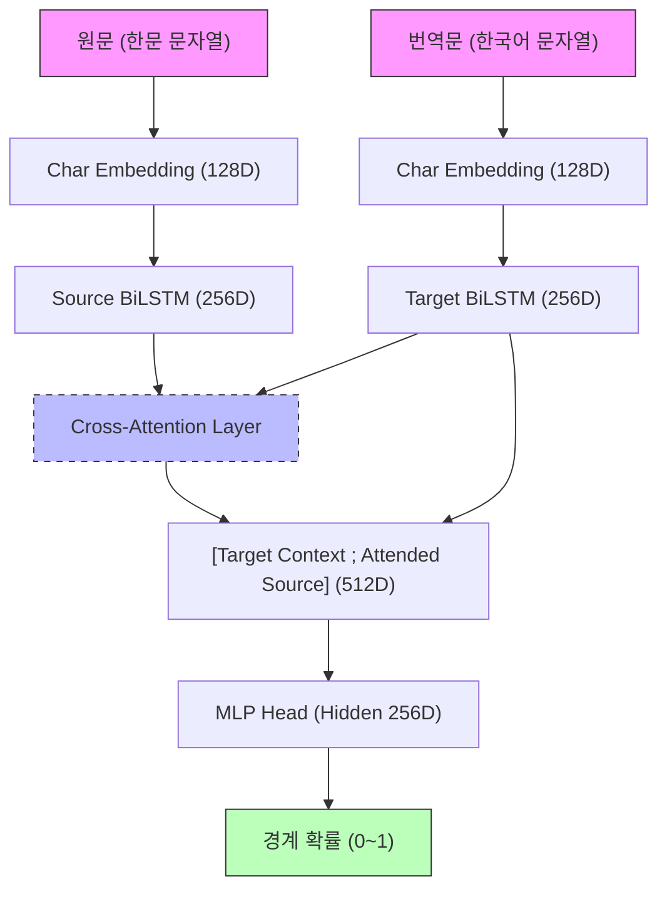

# S2P (Sentence-to-Phrase Aligner) 메커니즘 상세 설명

**버전**: 2026-01-19
**목적**: 문장 내 구(Phrase) 단위의 정렬 및 경계 추출 메커니즘 분석
**약칭**: S2P (구: SA)

---

## 1. 개요

SA(Sentence Aligner)는 **문장 단위**로 정렬된 원문-번역문 쌍을 입력받아, 그 내부의 **구(Phrase) 단위** 경계를 찾아내고 정렬하는 시스템입니다.

### 1.1 입력과 출력

| 구분 | 형식 | 예시 |
|------|------|------|
| **입력** | 문장 단위 (원문, 번역문) | ("學而時習之", "배우고 때때로 그것을 익히면") |
| **출력** | 구 단위 정렬 쌍 | [("學而", "배우고"), ("時習之", "때때로 그것을 익히면")] |

### 1.2 핵심 과제: 미세 경계(Micro-Boundary) 추출

PA(문단 정렬)가 문장 간의 거시적 경계를 찾는다면, SA는 문장 내부에서 한자 1~2글자 단위의 미세한 경계를 찾아내야 합니다.
- **원문**: 고전 한문 구(Phrase)는 의미적으로 완결된 최소 단위
- **번역문**: 원문의 구에 대응하는 한국어 어절들의 집합

### 1.3 핵심 전략: Cross-Attention 기반 상호 참조

SA는 원문과 번역문을 동시에 입력받아 서로 어느 부분이 대응하는지 **상호 참조(Cross-Attention)**하여 경계 확률을 예측합니다. 단순히 번역문만 보고 나누는 것이 아니라, "원문의 이 한자 뭉치가 번역문의 이 어절 뭉치와 같다"는 관계를 학습합니다.

---

## 2. 파이프라인 구조

SA는 4단계로 구성되며, 특히 **Boundary Model**의 역할이 지배적입니다.

```
[입력 문장 쌍] 
    ↓
[1단계] 문자 단위 임베딩 (Char-level Embedding)
    ↓
[2단계] Cross-Attention 문맥 융합
    ↓
[3단계] 경계 확률 예측 (Boundary Prediction)
    ↓
[4단계] 구 분할 및 정렬 (Segmentation & Alignment)
```

---

## 3. 핵심 구성 요소: SA Boundary Model (v3)

최근 업데이트된 **v3 모델**은 현존하는 가장 높은 성능(F1 0.8314)을 보여줍니다.

### 3.1 모델 아키텍처 (Anatomy of the Model)

SA 경계 모델은 순수 문자 단위(Character-level)의 딥러닝 모델로, **원문과 번역문의 상호 의존성**을 극대화하도록 설계되었습니다.



1.  **Dual Encoder (Input)**:
    - **Source (한문)**: BiLSTM을 통해 각 한자의 좌우 문맥 포착. 한자는 한 글자가 하나의 단어인 경우가 많아 문자 단위 분석이 매우 효과적입니다.
    - **Target (한국어)**: BiLSTM을 통해 번역문의 어절/문자 문맥 포착. 형태소 경계와 구두점 정보를 벡터 공간에 투영합니다.
2.  **Cross-Attention (The Core Engine)**:
    - **작동 원리**: 번역문의 각 타임스텝(문자 위치)을 `Query`로 삼아, 원문의 모든 문자(`Key/Value`) 중 어디에 집중해야 할지 계산합니다.
    - **정렬 학습**: 모델은 '배우고'라는 쿼리가 들어왔을 때 원문의 '學' 위치에 높은 어텐션 가중치를 부여하도록 학습됩니다. 이때 참조된 원문의 문맥 벡터가 번역문의 벡터와 융합됩니다.
    - **경계 인지**: 구의 시작점 근처에서는 어텐션의 분포가 급격히 변화(Shift)하거나, 특정 한자(접속사 등)에 집중되는 경향을 보입니다. 모델은 이 **어텐션의 전이(Transition)**를 경계의 핵심 신호로 활용합니다.
3.  **Boundary Head (Output)**:
    - 융합된 `[번역문_문맥 ; 원문_참조_벡터]`를 입력받아 MLP(Multi-Layer Perceptron)를 통과시킵니다.
    - 최종적으로 각 위치가 '구의 시작(Boundary)'일 확률을 0~1 사이로 출력합니다.

#### 뇌 구조에 비유한 해부:
- **LSTM (기억)**: 문장의 앞뒤 흐름을 기억함.
- **Cross-Attention (시각적 대조)**: 한쪽 문장을 읽으면서 동시에 다른 쪽 문장의 대응 지점을 눈으로 훑음.
- **MLP (판단)**: 수집된 모든 증거를 종합하여 "이곳이 경계인가?"를 최종 결정.

### 3.2 핵심 학습 기법: Boundary-aware Hard Negative Loss

단순한 학습으로는 경계 바로 옆 글자(O)와 경계 글자(B)를 구분하기 어렵습니다. v3에서는 이를 극복하기 위해 **가중치 손실 함수**를 도입했습니다.

- **경계 위치(B)**: 가장 높은 가중치 부여 (반드시 맞혀야 함)
- **경계 근처(O)**: 'Hard Negative'로 규정하여 가중치 부여 (경계 근처에서 헷갈리지 않게 함)
- **일반 위치(O)**: 표준 가중치

이 기법을 통해 기존 0.80 수준이었던 F1 스코어를 **0.83**까지 끌어올렸습니다.

---

## 4. 유사도 기반 정렬 (Alignment)

경계가 확정되면(또는 후보가 생성되면), 각 구 조각들 간의 의미적 일치도를 검증합니다.

### 4.1 BGE-M3 멀티 벡터 유사도
- PA와 동일하게 **BGE-M3** 모델을 사용하여 구 단위의 의미를 비교합니다.
- 조각이 매우 짧은(1~3글자) SA의 특성상 키워드 매칭(Sparse)과 토큰 매칭(ColBERT)의 비중이 중요하게 작용합니다.

---

## 5. 성능 및 최적화

### 5.1 처리 속도 최적화
대량의 데이터를 처리하기 위해 다음 기법들이 적용되어 있습니다.
- **Import Caching**: 실시간 row 처리 시 발생하는 모듈 로드 오버헤드 제거
- **Model Preloading**: 프로세스 시작 시 모델을 GPU 메모리에 미리 상주시켜 초기 Latency 0화
- **Batch Processing**: 여러 문장을 묶어 한 번에 추론

### 5.2 주요 하이퍼파라미터
- `boundary_threshold`: **0.55** (v3 튜닝 결과 최적값)
- `max_len_src`: 256 (원문 최대 길이)
- `max_len_tgt`: 512 (번역문 최대 길이)

---

## 6. 한계 및 향후 계획

1.  **주관적 경계 문제**: 구 단위 분할은 번역자마다 기준이 달라 '정답'이 유동적일 수 있습니다.
2.  **N:M 매칭**: 1:1 매칭 이상의 복잡한 대응 관계(원문 1구 = 번역문 2구 등)에 대한 정교한 처리가 향후 과제입니다.

---

## 부록 A: 토크나이저 활용 구조

SA 파이프라인은 PA와 달리 **경계 모델 중심**으로 설계되어 있으며, 외부 파서(SuPar 등)의 역할이 제한적입니다.

### A.1 토크나이저별 역할

| 대상 | 도구 | 역할 | 활용도 |
|:---|:---|:---|:---|
| **원문 (한문)** | **Kiwipiepy** | 현토(한국어 토씨) 위치 추출 | 경계 보너스 후처리 |
| **번역문 (한국어)** | **Kiwipiepy** | EC/EF 태그 기반 경계 후보 생성 | 폴백 분할 |
| **임베딩** | **BGE-M3** | 구 단위 유사도 계산 | 정렬 검증 |

### A.2 현토 보너스 (Huento Bonus)

원문에 포함된 한국어 현토(예: "學하며", "時하고")의 위치는 구(Phrase)의 자연스러운 경계입니다.

**작동 방식**:
1. Kiwipiepy로 원문의 조사/어미(EC, EF, JC 등) 위치 추출
2. Cross-Attention의 어텐션 가중치를 활용하여 해당 원문 위치에 집중하는 번역문 위치 탐색
3. 해당 번역문 위치의 경계 확률에 보너스 부여

**효과**: 미미한 향상 (+0.01% F1). v3 모델이 이미 Cross-Attention을 통해 원문-번역문 관계를 충분히 학습했기 때문.

### A.3 PA와의 차이점

| 항목 | PA | SA |
|:---|:---|:---|
| **주요 파서** | SuPar-Kanbun, Stanza | 없음 (경계 모델이 대체) |
| **경계 모델** | 보조 역할 | **핵심 역할** |
| **DP 리파인** | 필수 | 불필요 |
| **토크나이저** | SikuBERT, RoBERTa-Hanja, Kiwipiepy 모두 적극 활용 | Kiwipiepy 후처리용만 |
